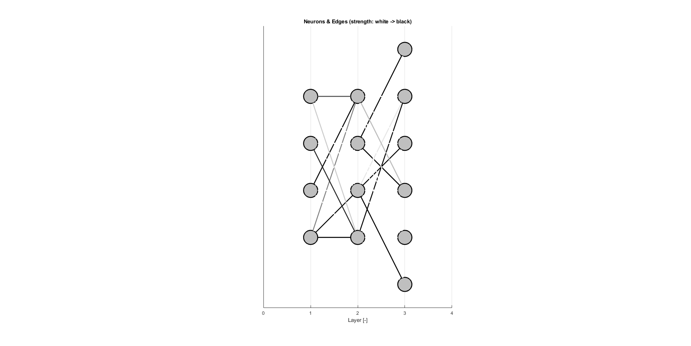
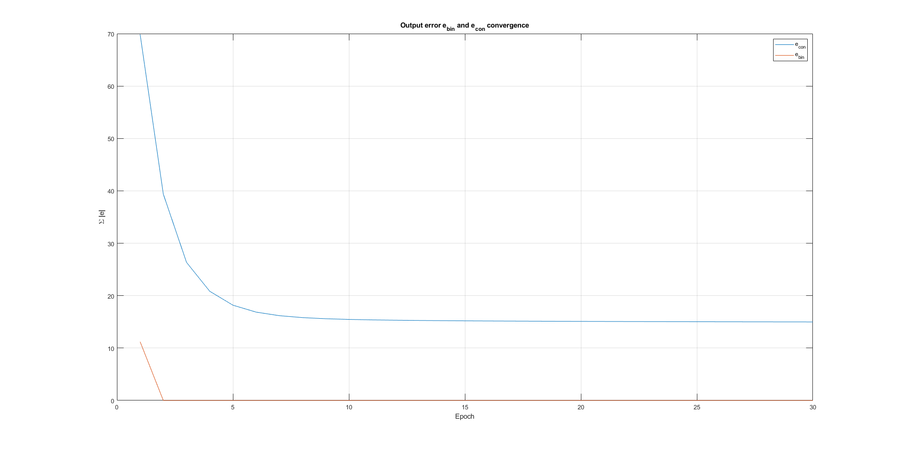
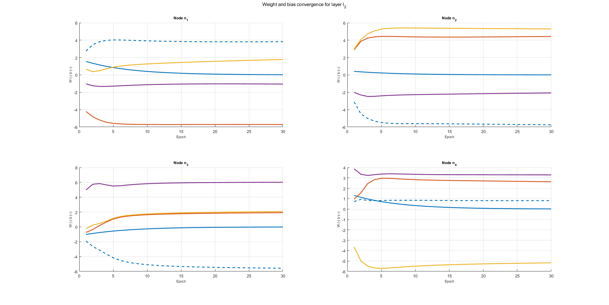
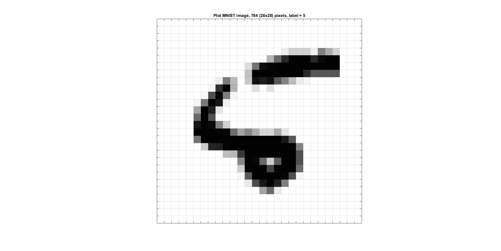

# matai
MATLAB AI toolbox for creation, training and testing of Neural Networks. Usefull as a learning platform for the concepts of Artcifical Neural Networks.

## Prerequisites
* MATLAB (>= R2014b)

## Getting Started
Just run and start modify the example scripts *MainANN_SimpleData.m* and *MainANN_MNISTData.m*. A lot of customazation for building and tuning of the network exist.

## Analysis

### Features
TODO: List features and settings.

### Console log
```bash
*** Traning started 2020-02-28 15:49:47 ***
    Layers        :   6
    Neurons       :   1154 (784x192x96x48x24x10)
    Batch size    :   100
    Epochs        :   5
       + Epoch 1
           Train error: 10.32 %
       + Epoch 2
           Train error: 6.27 %
       + Epoch 3
           Train error: 4.17 %
       + Epoch 4
           Train error: 4.02 %
       + Epoch 5
           Train error: 3.27 %
    Traning time  :   15.0164 s
*** Traning completed 2020-02-28 15:50:02 ***
Train error: 3.27 %
Test error: 3.92 %
```

### Plots




